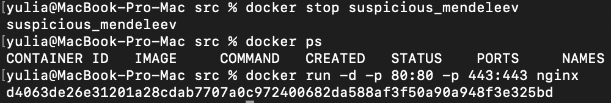

## Part 1. Готовый докер

**== Задание ==**

##### Взять официальный докер образ с **nginx** и выкачать его при помощи `docker pull`
##### Проверить наличие докер образа через `docker images`

##### Запустить докер образ через `docker run -d [image_id|repository]`
##### Проверить, что образ запустился через `docker ps`

##### Посмотреть информацию о контейнере через `docker inspect [container_id|container_name]`
##### По выводу команды определить и поместить в отчёт размер контейнера, список замапленных портов и ip контейнера


##### Остановить докер образ через `docker stop [container_id|container_name]`
##### Проверить, что образ остановился через `docker ps`
##### Запустить докер с замапленными портами 80 и 443 на локальную машину через команду *run*



##### Проверить, что в браузере по адресу *localhost:80* доступна стартовая страница **nginx**


##### Перезапустить докер образ через `docker restart [image_id|repository]`
##### Проверить любым способом, что контейнер запустился


## Part 2. Операции с контейнером

**== Задание ==**

##### Прочитать конфигурационный файл *nginx.conf* внутри докер образа через команду *exec*

С помощью команды `docker exec -it [id контейнера]` выводим содержимое файла `/etc/nginx/nginx.conf`:


##### Создать на локальной машине файл *nginx.conf*
##### Настроить в нем по пути */status* отдачу страницы статуса сервера **nginx**

Создаем файл `nginx.conf` на локальной машине с помощью команды `touch`. До этого конфигурация сервера бралась из другого конфига `default.conf` в папке `conf.d`. В новом конфиге убираем строчку:

```
`include /etc/nginx/conf.d/*.conf;`
```

И добавляем:

```
server {
        listen       80;
        listen  [::]:80;
        server_name  localhost;
        location / {
            root   /usr/share/nginx/html;
            index  index.html index.htm;
        }

        location /status {
            stub_status;
        }

        error_page   500 502 503 504  /50x.html;
        location = /50x.html {
            root   /usr/share/nginx/html;
        }
    }
```

Обозначения:
- `listen` порты прослушиваемые для входящего подключения
- `server_name` название сервера
- `location /` содержимое домашней страницы сайта
- `location /status` содержимое страницы *localhost:80/status*
- `error_page` содержимое страницы при возникновении ошибок


##### Скопировать созданный файл *nginx.conf* внутрь докер образа через команду `docker cp`
##### Перезапустить **nginx** внутри докер образа через команду *exec*

Копируем файл `nginx.conf` с локальной машины в контейнер:

```
docker cp nginx.conf d4063de26e31:/etc/nginx/
```

Проверяем `nginx.conf` на корректность синтаксиса:

```
docker exec -it d4063de26e31 nginx -t
```

Перезагружаем `nginx`:

```
docker exec -it d4063de26e31 nginx -s reload
```


##### Проверить, что по адресу *localhost:80/status* отдается страничка со статусом сервера **nginx**


##### Экспортировать контейнер в файл *container.tar* через команду *export*

Экспортируем контейнер, затем останавливаем его:


##### Удалить образ через `docker rmi [image_id|repository]`, не удаляя перед этим контейнеры

Проверяем что он остановился. После чего удаляем образ `nginx` командой `docker rmi [image_id|repository]`. При попытке удалить образ этой командой появляется сообщение о том что данный образ используется контейнером. Поэтому выполняем ту же команду, но уже используя флаг `-f` для принудительного удаления:


##### Импортировать контейнер обратно через команду *import*
##### Запустить импортированный контейнер

Импортируем контейнер:

```
docker import - imported_cont < container.tar
```


Запускаем:

```
docker run -d -it -p 80:80 -p 443:443 imported_cont bash
```

Проверяем что контейнер запустился:

```
docker ps
```

Запускаем на контейнере сервис nginx:

```
docker exec -it quirky_pascal bash
```


Проверяем, что по адресу localhost:80/status отдается страничка со статусом сервера nginx:


